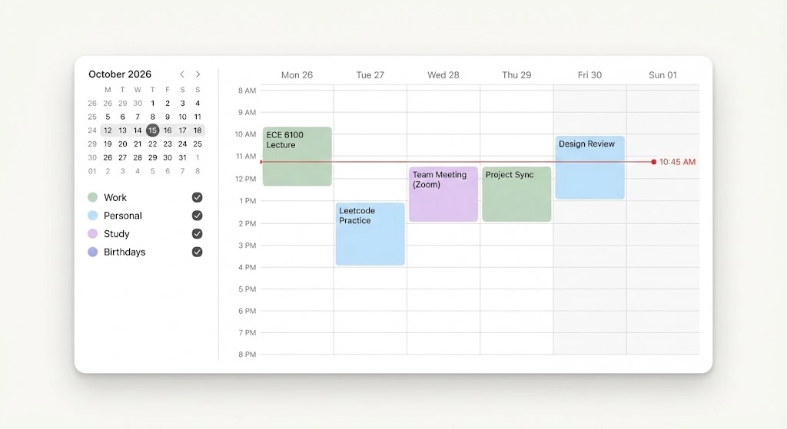

# Calendar UI Developer Spec

## Purpose

This spec is for Flutter frontend implementation of the desktop weekly calendar UI.
It defines the unified container layout language and component structure.
It does not define event data rules, scheduling logic, or sync behavior.

## Reference Images



## Visual Direction

- One unified floating container for the entire calendar experience.
- Internal split view: compact left sidebar + wide weekly grid.
- Subtle inset vertical divider as a key visual separator.
- Clean, high-readability weekly time grid with event blocks.

## Layout Grammar

- Outer shell: single rounded container.
- Inner content: `Row`
  - left sidebar (fixed width)
  - inset vertical divider
  - right weekly view (expanded)
- Weekly view supports vertical scrolling and clipped corners.

## Suggested Widget Structure

```text
CalendarPage
  Center
    ConstrainedBox
      Container (single unified card)
        Row
          SizedBox(width: sidebarWidth)
            CalendarSidebar
          VerticalDivider(indent/endIndent)
          Expanded
            ClipRRect(right corners)
              WeekGridView
```

## Component Requirements

- `CalendarSidebar`
  - mini month calendar block
  - category/source list with marker dots
- `WeekGridView`
  - time axis
  - day columns
  - horizontal separators
  - event blocks rendered above grid
  - current-time indicator line

## Visual Layering Rules

- Weekly grid is the base layer.
- Event blocks are overlay layer above grid.
- Current-time line is top emphasis layer.
- Divider should be subtle and inset from top/bottom edges.

## State Model (UI Only)

- Grid states: normal, loading placeholder.
- Event block states: default, hover, selected.
- Category states: enabled, muted.

## Responsive Rules

- Maintain unified card structure on desktop widths.
- In compact widths, reduce sidebar width before reducing weekly readability.
- Ensure week grid remains scrollable when vertical space is constrained.

## Implementation Notes

- Use one outer `Container` for the whole card shell.
- Avoid separate card backgrounds for sidebar and grid pane.
- Use clipping on right pane to keep corners clean while scrolling.
- Keep divider and shadow styling tokenized for reuse.

## Acceptance Checklist

- Unified single-card split layout is reproduced.
- Inset vertical divider is present and visually subtle.
- Weekly grid, event overlays, and current-time line are layered correctly.
- Sidebar and weekly view remain visually coherent during resize.
