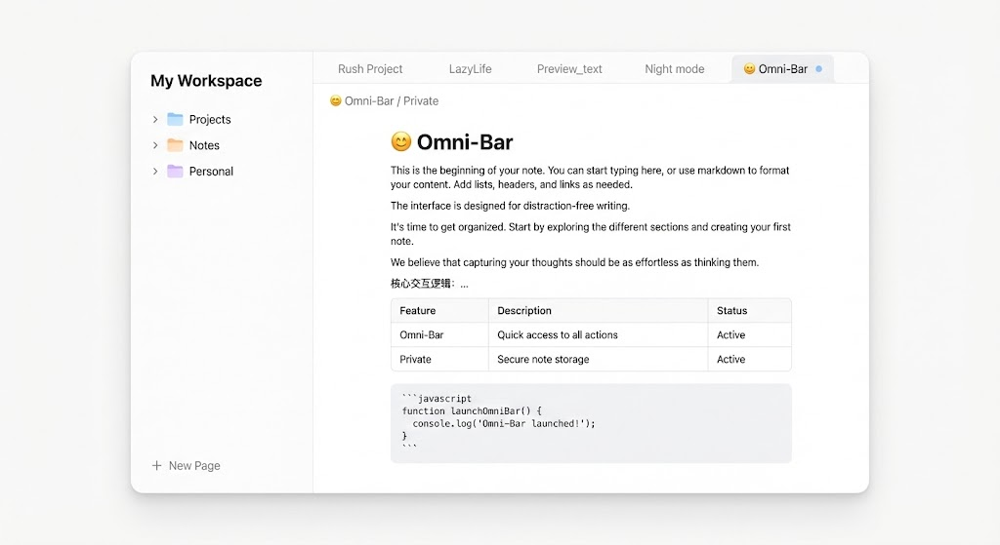
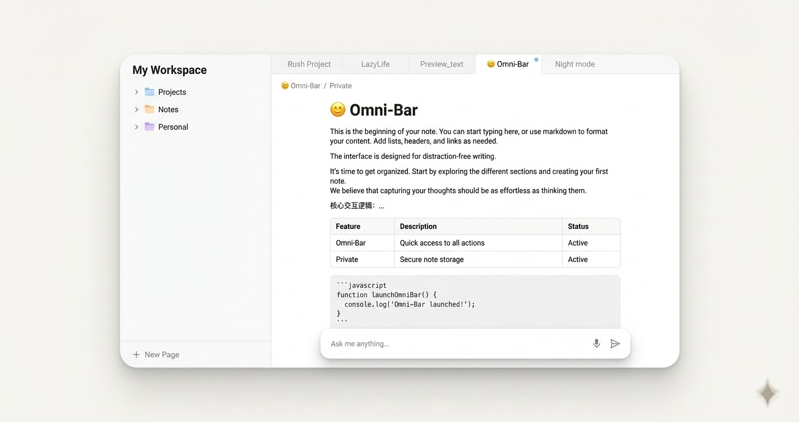

# Note UI Developer Spec

## Purpose

This spec is for Flutter frontend implementation of the Notes workspace UI.
It defines layout, component structure, and interaction states only.
It does not include business logic, API behavior, or persistence rules.

## Reference Images





## Visual Direction

- Desktop-first workspace with a two-pane shell.
- Calm, low-noise interface with clear reading focus.
- Document-centric hierarchy: title, metadata, tags, editor.
- Optional floating AI capsule as an overlay layer, not a page-level footer.

## Layout Grammar

- Root: `Column`
- Header row at top.
- Main area: `Row`
- Left pane: explorer/navigation area with fixed width.
- Middle: 1px vertical divider.
- Right pane: editor workspace using remaining width.
- Right pane internal structure:
  - top tab strip
  - content/editor region
  - optional floating capsule input in overlay mode

## Suggested Widget Structure

```text
NotesPage
  Column
    HeaderBar
    Expanded
      Row
        SizedBox(width: explorerWidth)
          NoteExplorer
        VerticalDivider
        Expanded
          Column
            NoteTabManager
            Expanded
              Stack
                NoteContentArea
                OptionalFloatingCapsuleInput
```

## Component Requirements

- `HeaderBar`
  - back action
  - page title
  - refresh action
  - optional shortcut hint chip
- `NoteExplorer`
  - section title + create/reload actions
  - filter area placeholder (optional)
  - note list rows with selected state
- `NoteTabManager`
  - horizontally scrollable tabs
  - active tab emphasis
  - per-tab close action
  - optional context menu support
- `NoteContentArea`
  - top action row
  - save status area placeholder
  - title + updated timestamp text slot
  - tags section
  - full-height editor
- `FloatingCapsuleInput` (optional variant)
  - anchored bottom-center in editor pane
  - microphone/send icon slots
  - ensure bottom padding in scroll content to prevent overlap

## State Model (UI Only)

- List states: loading, error, empty, success.
- Detail states: loading, error, unavailable, ready.
- Editor states: clean, dirty, saving, save-error.
- Row states: default, hover, selected.
- Tab states: inactive, active, hover.

## Responsive Rules

- Compact header when width is limited.
- Collapse secondary top actions into overflow menu in narrow editor width.
- Keep explorer width stable to avoid navigation reflow.
- Keep editor content in a readable max-width center column.

## Implementation Notes

- Use `LayoutBuilder` for compact/expanded switching.
- Use `ConstrainedBox` for max reading width in editor content.
- Use `Stack` only when floating capsule variant is enabled.
- Keep spacing scale consistent across panes and controls.

## Acceptance Checklist

- Two-pane workspace reproduces reference layout.
- Tab strip + explorer + editor composition is stable during resize.
- Optional floating capsule is visually layered and does not block final lines of text.
- UI states are visually distinguishable without business logic wiring.
