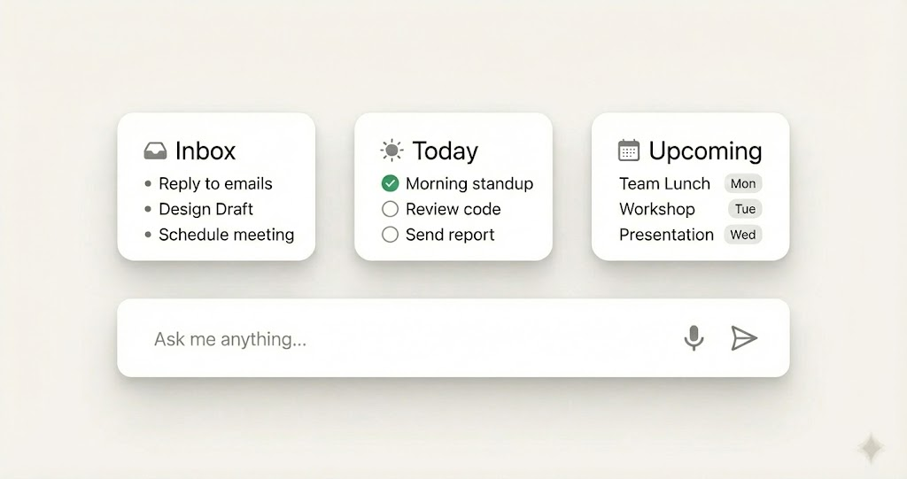

# Task UI Developer Spec

## Purpose

This spec is for Flutter frontend implementation of the Tasks dashboard UI.
It defines visual structure, component composition, and interaction behavior.
It does not define task-domain logic or backend rules.

## Reference Images





## Visual Direction

- Top-level dashboard row with three equal cards.
- Card-first information architecture: Inbox, Today, Upcoming.
- Lightweight productivity aesthetic with quick scan readability.
- Optional capsule input variant for unified command entry.

## Layout Grammar

- Root dashboard section: `Row`.
- Three cards use equal width distribution.
- Fixed gap between cards.
- Cards share one unified card style token set.
- Card internals:
  - header row (title + icon + optional actions)
  - list body

## Suggested Widget Structure

```text
TaskDashboardSection
  Row
    Expanded
      InboxCard
    SizedBox(width: gap)
    Expanded
      TodayCard
    SizedBox(width: gap)
    Expanded
      UpcomingCard
```

## Component Requirements

- `InboxCard`
  - title + inbox icon
  - optional add button in header
  - list style: bullet list items
  - create mode: inline text input at top of list
- `TodayCard`
  - title + day icon
  - list style: checkbox style rows
  - checked and unchecked visual states
- `UpcomingCard`
  - title + calendar icon
  - list style: label + right-side date tag
- `TaskRow` variants
  - bullet row
  - checkbox row
  - tag/date row

## Drag-and-Drop Interaction (UI Layer)

- Inbox rows are draggable sources.
- Today/Upcoming cards are drop targets.
- During drag hover, targets provide clear highlight feedback.
- On drop, item re-renders with destination card row style.

## Optional Capsule Variant

- Capsule can appear as a floating or bottom-aligned command input.
- Keep capsule independent from card layout constraints.
- Reserve safe bottom space in scrollable content when overlay is used.

## State Model (UI Only)

- Card states: normal, hover, active-drop-target.
- Item states: default, dragging, dropped.
- Input states: idle, editing, submit-ready.

## Responsive Rules

- On narrow width, degrade from 3-column row to wrapped or stacked layout.
- Preserve per-card internal hierarchy when stacked.
- Keep interaction affordances (add, drag hint, drop highlight) visible in compact mode.

## Implementation Notes

- Use shared card widget with slot-based content.
- Keep three card variants in separate view classes for maintainability.
- Prefer explicit spacing and constraints over implicit layout behavior.

## Acceptance Checklist

- Three equal cards with stable spacing are reproduced.
- Card row variants match reference structure.
- Drag source/target feedback is visible and consistent.
- Capsule variant can be toggled without breaking card composition.
