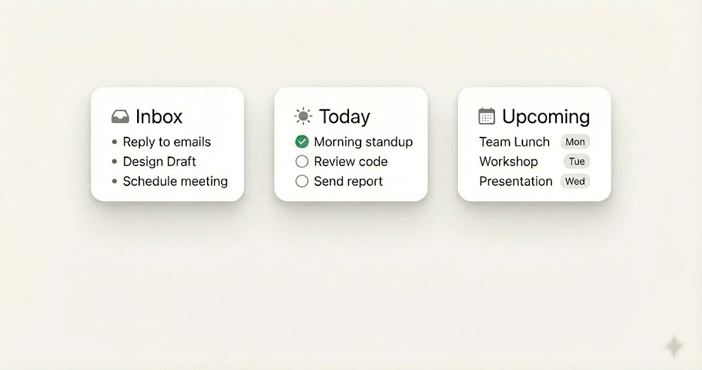
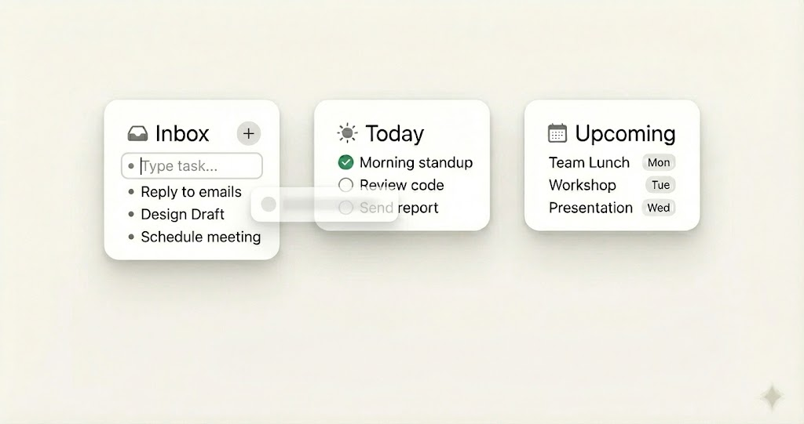

### Flutter 组件开发需求：Dashboard Overview Row

**组件描述：**
这是一个位于页面顶部的水平展示组件，包含三个等宽的卡片（Inbox, Today, Upcoming）。目前**不需要**底部的搜索/输入栏，只专注于这三个卡片的布局和内部样式。

### 1. 布局结构 (Layout Architecture)

- **根组件：** 使用 `Row`。
- **子元素分布：**
    - 包含 3 个卡片，每个卡片使用 `Expanded` 包裹，以确保它们在水平方向上**等宽**且占满可用空间。
    - 卡片之间需要固定的间距（建议 `SizedBox(width: 12)` 或 `16`）。
- **高度：** 卡片高度应根据内容自适应（或设定一个最小高度，例如 `140.0`），并保持三个卡片高度一致（使用 `IntrinsicHeight` 如果内容差异大，或者固定高度）。

### 2. 通用卡片样式 (Shared Card Style)

所有三个卡片共享相同的外观容器（Container Style）：

- **背景色：** 纯白 (`Colors.white`)。
- **圆角 (BorderRadius)**：统一的中等圆角，建议 `BorderRadius.circular(16.0)`。
- **阴影 (BoxShadow)**：非常关键。需要一个柔和的、低透明度的弥散阴影，营造悬浮感。
    - 参考：`color: Colors.black.withOpacity(0.05), blurRadius: 10, offset: Offset(0, 4)`。
- **内边距 (Padding)**：卡片内部内容与边缘的距离，建议 `EdgeInsets.all(16.0)`。

### 3. 卡片内容差异化 (Content Variations)

每个卡片内部由“**标题行**”和“**任务列表**”组成。

- **A. 左侧卡片 - Inbox (收件箱)**
    - **Header:** 标题 "Inbox" + 图标 `Icons.inbox_outlined` (或类似托盘图标)。
    - **List Style:** **无序列表 (Bulleted List)**。
    - **Item:** 小圆点 (`Container` circle) + 文本。
    - *示例:* `Reply to emails`
- **B. 中间卡片 - Today (今日)**
    - **Header:** 标题 "Today" + 图标 `Icons.wb_sunny_outlined` (太阳图标)。
    - **List Style:** **复选框列表 (Checkbox List)**。
    - **Item:** 圆形复选框 (自定义 Icon 或 Shape) + 文本。
    - *状态:* 需要展示“已勾选(绿色)”和“未勾选(空心灰)”两种状态。
- **C. 右侧卡片 - Upcoming (日程)**
    - **Header:** 标题 "Upcoming" + 图标 `Icons.calendar_today_outlined` (日历图标)。
    - **List Style:** **标签列表 (Tag List)**。
    - **Item:** 文本 + 右侧的一个圆角小标签 (Container with text "Mon", "Tue" etc.)。
    - *布局:* 使用 `Row` + `MainAxisAlignment.spaceBetween` 将任务名和日期标签分开。

### 1. 视觉与交互逻辑设计 (UI/UX Design)

### A. Inbox 卡片的头部变化

- **新增 "+" 按钮：** 在 Inbox 标题栏的右侧（图标旁边），增加一个明显的、可点击的“+”号按钮。
- **点击后的交互：** 点击“+”后，Inbox 列表的最顶端会出现一个临时的**输入框 (Text Input Field)**。
- **输入状态：** 这个输入框应该很小巧，风格和下面的任务列表项一致，但是带有光标，按 Enter 键确认添加。

### B. 拖拽交互 (Drag & Drop)

- **源 (Source):** Inbox 里的每一个任务项都是“可拖拽的 (Draggable)”。
- **目标 (Target):** Today 和 Upcoming 卡片变成“放置区 (Drop Zone)”。
- **视觉反馈：**
    - 当你拖动一个 Inbox 任务时，Today 和 Upcoming 卡片应该高亮（比如边缘变色或背景微微变深），提示用户“可以放这里”。
    - **放下后 (On Drop):** 任务从 Inbox 消失，出现在目标卡片中，并且**样式会自动改变**（例如：从 Inbox 拖到 Today，原本的小圆点会自动变成复选框）。